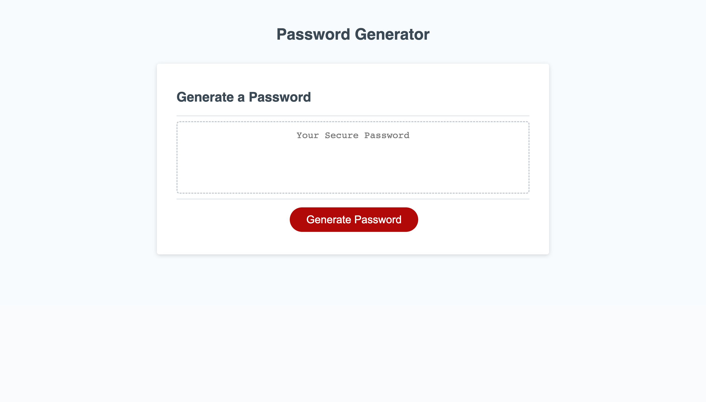

# secure-password-generator

## Description
My motivation in building this project was to create a secure password generator that forms a unique password based on the user's choices given the prompts on screen. I built this project in order to satisfy the need of an employee who desired a strong, randomly generated password in order to protect sensitive data they have access to at work. I solved the problem of the given password generator code not yielding a password upon clicking the "generate" button. I fixed the given code so that when the user clicked the "generate" button, a series of prompts initialized asking the user to choose a password length within the specified parameters, then which characters they would like to include in the generated password. Once navigating through the prompts, the user is then met with a password that meets their specifications. My code also solves the problem of whether or not the password chosen by the user does not meet length or character requirements. It will end the function and ensure the user picks a preferred length between the given range and at least one character. My code also includes comments throughout that explain each JavaScript element and its use in my project. Throughout this process I learned how to call various functions in JavaScipt as well as utilize for loops, methods, arrays, conditional statements, and prompts to the window. I was able to use fundamental aspects of JavaScript in order to make a functioning password generator.

## Usage

When reaching the password generator site, the user is met by a button that says "Generate Password". When the user clicks that button, they will be met with a prompt in the window that asks their desired password length between 8 and 128 characters. If they do not choose a password that fits this criteria, they will be alerted that their password is invalid and they must retry the process, clicking the password generator again to restart the process. One the user enters a valid value to the length prompt, they will then be met by a series of prompts that ask them if they would like lowercase letters, uppercase letters, numbers, or special characters included in their password. They can choose any combination of characters to be included in their password, but they must choose at least one character type or else they will be alerted that their choice is invalid and must restart the process. Once the user has successfully answered each prompt, a unique password will show up in place of the "Your Secure Password" text, and the user will be able to copy that password and use it as they please. They will also be able to refresh the page and choose a new password if they please. Here is a link to my deployed site https://kendrafitzgerald.github.io/secure-password-generator/ !

md
     

## How to Contribute

If you would like to contribute, please reach out to me via email @ kendrajfitzgerald@gmail.com. I would love any input on how I can make my code cleaner or more functional. 

